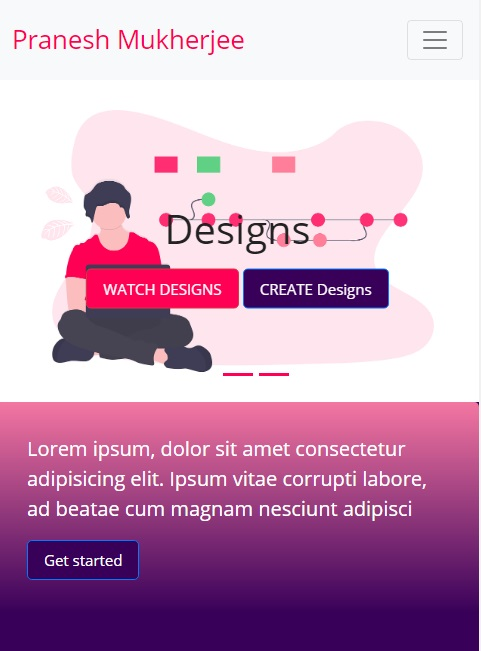
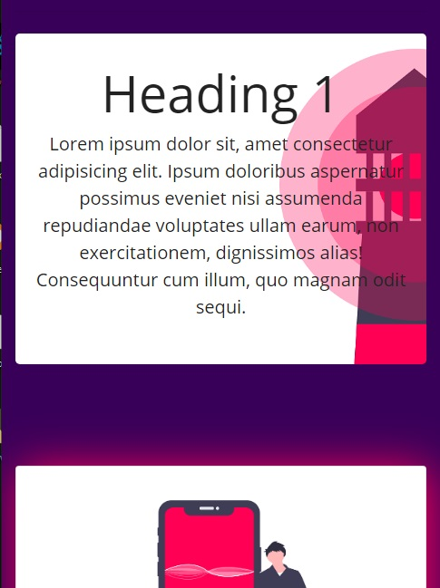
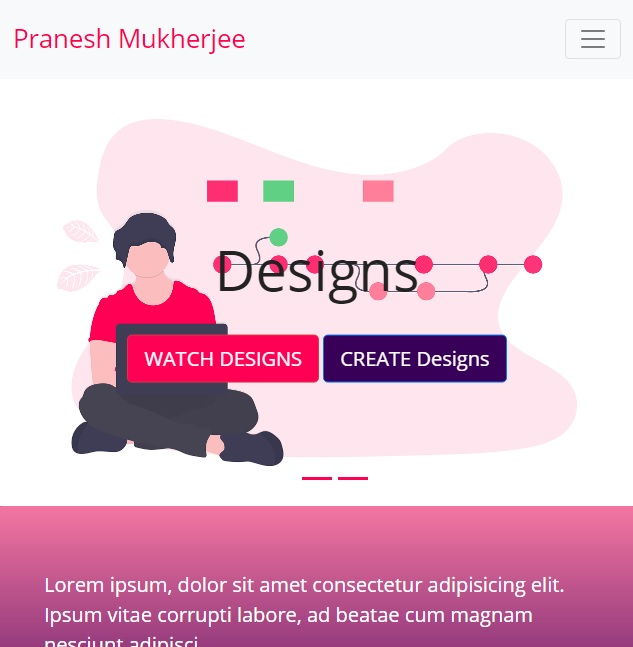
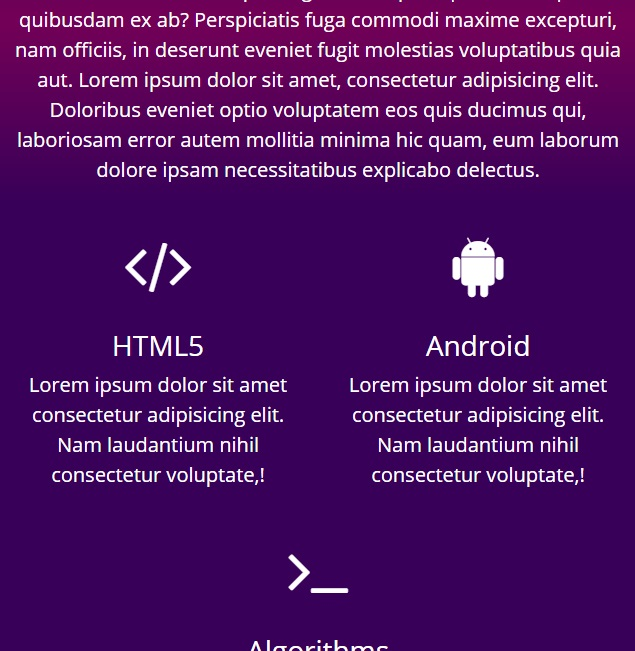
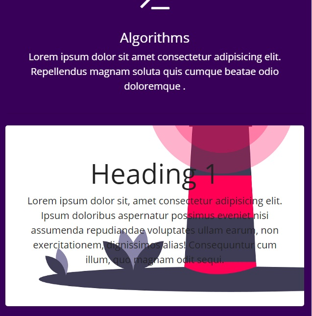
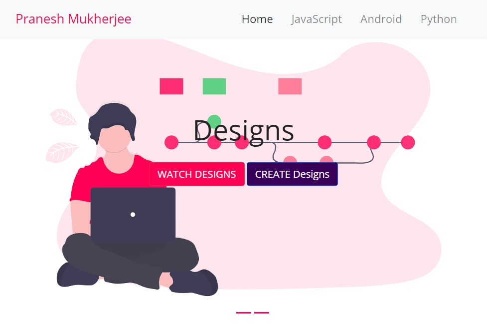
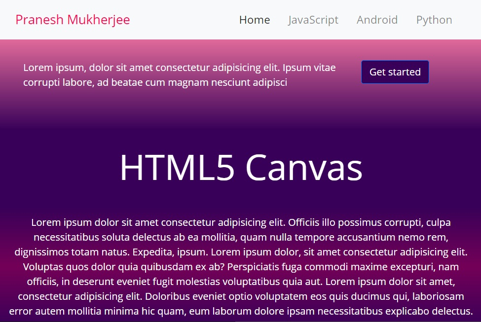
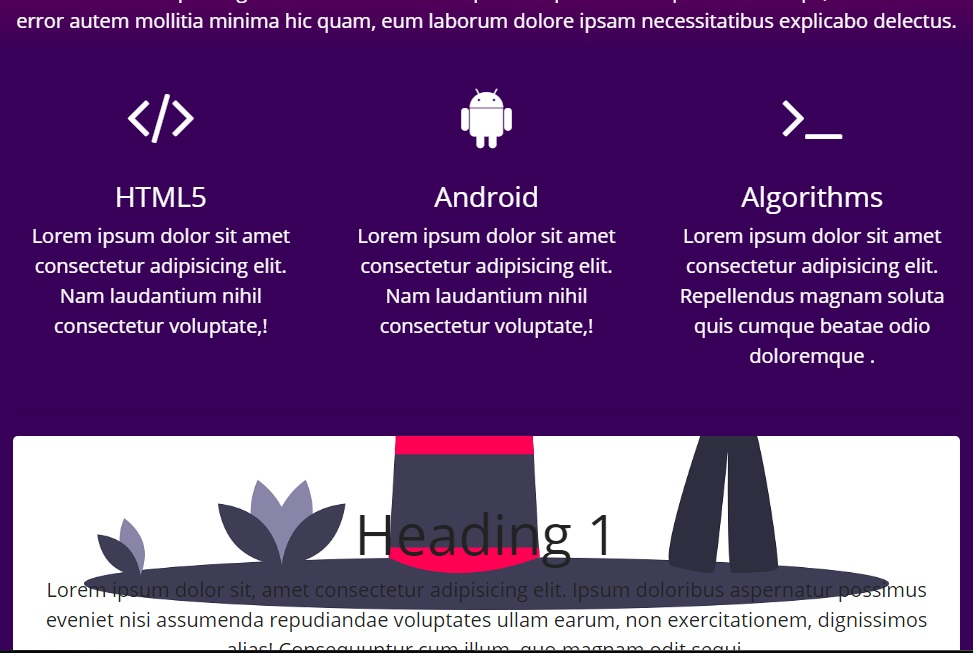
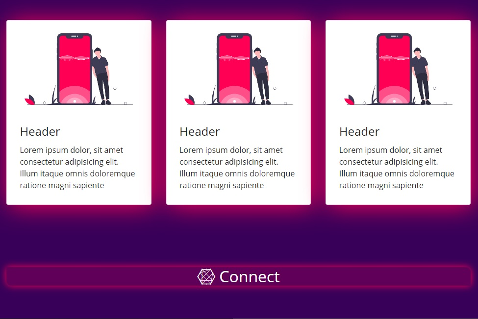

# Responsive_Webpage_Using_Bootstrap4
My first attempt to Responsive Web Design using **Bootstrap 4.**

**Bootstrap page:** <https://mukhopadhyay.github.io/Responsive_Webpage_Using_Bootstrap4/>

This webpage is made using the latest distribution of Bootstrap, Version 4. And I used the CDN (Content Delivery Network). External CSS file *css/main.css* is used for overriding the default Bootstrap themes and color schemes.
To make the website responsive to the screen width CSS media query is used. So that the screen automatically scales according to the device's screen.

**Webpage on standard mobile resolution**
*In mobile format the navigation bar will be shortened to a button, and the navbar menu links will be accessed by clicking the button and the social links will be reduced in size.*

**Webpage on standard tablet resolution**
*In Tablet format the navigation menu will stay as a button, but the grids will be changed*

**Webpage on standard desktop resolution**
*In Desktop format the links in the navigation bar will be display, and the navbar will be sticky, i.e., the navigation bar will be staying on top up to a certain scroll amount and afterwards the navigation bar will be hidden.*

**Image Resources were taken from: <https://undraw.co/> **
