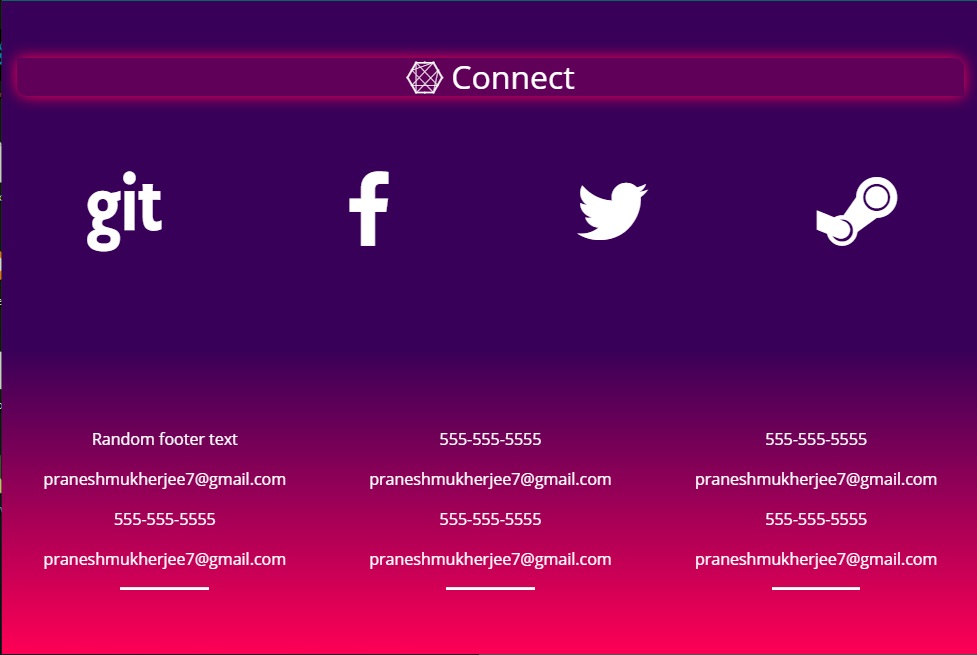

# Responsive_Webpage_Using_Bootstrap4
My first attempt to Responsive Web Design using **Bootstrap 4.**

This webpage is made using the latest distribution of Bootstrap, Version 4. And I used the CDN (Content Delivery Network). External CSS file *css/main.css* is used for overriding the default Bootstrap themes and color schemes.
To make the website responsive to the screen width CSS media query is used. So that the screen automatically scales according to the device's screen.

**Webpage on standard mobile resolution**

**Webpage on standard tablet resolution**

**Webpage on standard desktop resolution**

